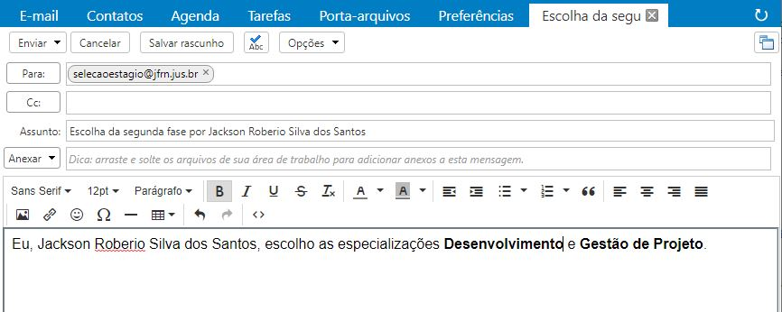

  

<h1 align="center"> Processo Seletivo para Estágio Remunerado na Justiça Federal no Rio Grande do Norte (JFRN) </h1> 

Este documento tem por objetivo instruir e orientar sobre a segunda (2ª) fase aos candidatos <a href='https://www.jfrn.jus.br/administracao/estagios/2020/edital-resultado-1a-fase.pdf' target='_blank' > aprovados na primeira fase </a>   do processo seletivo para estágio remunerado na JFRN para estudos da área de Tecnologia da Informação, nas especializações: Desenvolvimento, Business Inteligence & Gestão de Projetos. 

## 1 - INSTRUÇÕES :page_with_curl:

Nesta fase o candidato terá **três** (3) desafios disponíveis, dentre os **três** (3) desafios, o candidato precisará escolher **duas** opções e reportar os desafios escolhidos através de [e-mail](mailto:selecaoestagio@jfrn.jus.br) ou diretamente por este [github](https://github.com/jackson-roberio/selecao-estagio-jfrn-2020/issues/new).

Os desafios destina-se às áreas da tecnologia da informação, nas especialidades a qual este documento contempla, sendo elas:

   - **DESENVOLVIMENTO**; 
   - **BUSINESS INTELLIGENCE**; 
   - **GESTÃO DE PROJETOS**.

### 2 - Envio das Escolhas

   - Por **Email**: O envio das escolhas por e-mail deve seguir o seguinte padrão:
      - **De (aquele que enviará a mensagem):** envie com o mesmo e-mail cadastrado no ato de inscrição do processo seletivo  
      - **Para (Destinatário):** selecaoestagio@jfrn.jus.br
      - **Assunto (título da mensagem):** Escolha da segunda fase por *{seu_nome_completo}*
      - **Mensagem:** Eu, *{seu_nome_completo}*, escolho as especializações *{primeira_especialização_escolhida}* e *{segunda_especialização_escolhida}*
      
      Exemplo:
      
      

         
      

      
``      
OBS: Não é necessário a inserção de nenhum anexo nas escolhas das especializações. O usuário terá 24 horas para o envio das escolhas das especializações, escolha de especialização enviada fora do prazo serão desconsideradas.
``

   - Por **Github**:

## 3 - DESAFIOS :round_pushpin: 

### 3.1 - Desenvolvimento

### 3.2 - Business Inteligence

### 3.3 - Gestão de Projetos

  

